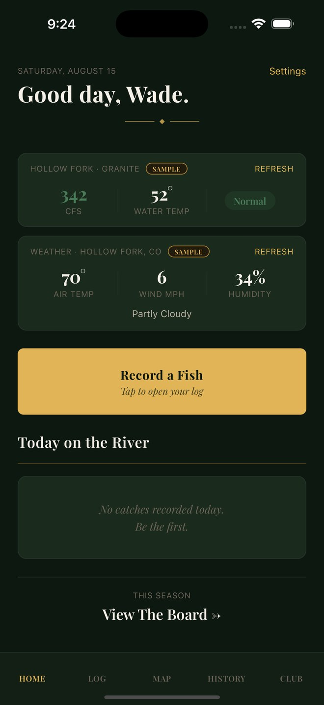
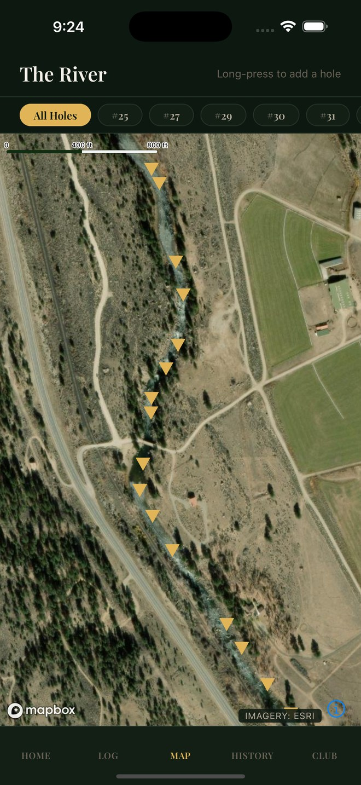
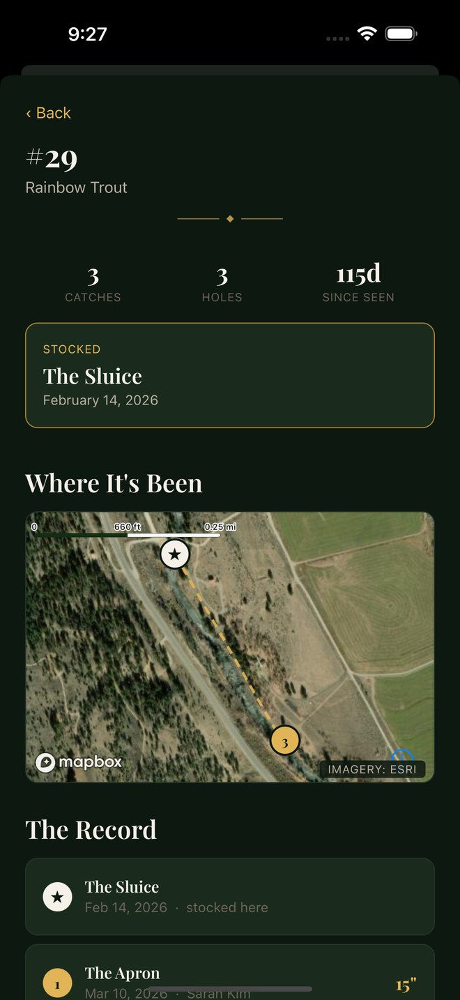

# Walden Hollow

**A fishery management platform for private water. Built solo. Shipped to real anglers on TestFlight.**

Members log every catch from the riverbank. The app records the fish, the hole, the
water conditions, and the photograph. Over a season, that log becomes the only
continuous dataset that exists for that stretch of river.

  
  
  

Screenshots run on sample data. A test blocks the real club's coordinates from reaching a public build.

---

## What it does

- **Log a catch in under 30 seconds**, one-handed, with a wet fish in the other hand.
- **Name individual fish and track them.** Every recapture adds a point to that fish's growth curve and movement history.
- **Attach live water data.** USGS gauge flow and temperature bind to each catch at the moment it happens.
- **Map every hole** on satellite imagery. Members add holes by long-press.
- **Run a season leaderboard** across the club.

## Results

| | |
|---|---|
| **Shipped** | iOS, TestFlight, in active use by a paying club |
| **Built by** | One engineer, end to end |
| **Scope** | 19 screens, 91 TypeScript files, 232 lines of security rules |
| **Tests** | 154 passing across 11 suites, including security rules against the Firebase emulator |
| **CI** | Typecheck, lint, unit tests, and rules tests on every pull request |

TypeScript runs in strict mode. Every data path has a test. Every list query has a cap.

---

## Engineering

### Security rules are the entire authorization system

The app has no backend server. Clients talk to Firebase directly. That makes
`firestore.rules` and `storage.rules` the only barrier between one member and
another member's data.

I treat those 232 lines as production code. They are version controlled, reviewed in
every pull request that touches them, and tested with `@firebase/rules-unit-testing`
against the emulator in CI. The suite proves three things. A member cannot escalate their own role to admin.
A member cannot read another member's profile. A member cannot delete a record they
do not own.

### The bug that green tests could not catch

`storage.rules` calls `firestore.exists()` to confirm club membership before it
accepts a photo upload. This is a cross-service rule. The Storage engine must read
Firestore to evaluate it, and that read requires an IAM grant.

The Firebase Console adds that grant automatically. A CLI deploy does not.

Without the grant, `firestore.exists()` returns false for every user. Every upload is
denied. Catch photos were discarded silently through the first beta while 16 green
emulator tests reported the logic as correct. The emulator does not enforce the
service boundary.

I found it, fixed it, and changed the deployment process. Every rules deploy now ends
with a check against the live backend: sign in as a real member and read a path that
does not exist. `object-not-found` means the rule passed. `unauthorized` means it did
not.

**The lesson generalizes.** A test suite proves your logic. It does not prove your
infrastructure. Know which one you are testing.

### A bug class, not a bug

`match /outings/{outingId}` had rules for `read`, `create`, and `update`. It had no
rule for `delete`. Firestore denies by default, so deleting an outing failed
silently. No error reached the user.

This was the third time the same shape appeared. I fixed the class instead of the
instance. Every collection now carries an explicit delete rule, and five tests cover
the outing case alone.

**Create and update never imply delete. The failure is always silent.**

### Every data path runs from fixtures

One environment variable switches the entire app to fictional data. No network, no
Firebase, no live club records.

Every screen reads through a mock-aware hook. No screen touches Firestore directly.
That rule makes the switch total instead of partial, and tests enforce it.

This unlocked three things:

1. Development that never touches production data.
2. App Store screenshots that expose no member's real fishing spots.
3. A demo mode for sales calls.

The fixtures place a fictional river 50 km from the real one. A test measures that
distance and fails the build if it shrinks. A second test sweeps every source file
for the real river's name. It caught two hardcoded strings that grep alone missed,
because a literal inside a component belongs to no constant.

### Guided capture is a geometry problem

Photo identification of individual fish needs a consistent frame. Members photograph
a fish inside a guide overlay, so every image shares the same scale and axis.

The naive approach fixes the overlay at a percentage of screen width. I measured
instead. The guide solves for the largest fish that fits both the width and the
height of the available area, then reports the fill ratio it achieved. The geometry
lives in a pure function with no camera dependency, so it is unit tested across
device sizes.

I assumed height would be the binding constraint in landscape. The tests disproved
it. Width binds on every real device. I corrected the code and the comment.

### Automated App Store screenshots

Store submissions need six screenshots at exact pixel dimensions. Capturing them by
hand takes an hour and produces inconsistent results.

I added deep links to every read-only route. A script then boots the simulator,
drives the app through those routes with `xcrun simctl`, and captures at
1320 x 2868. Six screenshots, one command, reproducible.

---

## Next: making the tag obsolete

Today an admin implants a physical tag to track an individual fish. That limits
tracking to the fish the club has physically handled.

Brown and rainbow trout carry unique flank spot patterns. The patterns hold across
years. The fish already wears its own tag.

The published results are strong:

- **Atlantic salmon: 100% accuracy across 328 individuals**, with pattern stability confirmed over six months. The authors conclude that the method replaces physical tagging. ([Scientific Reports, 2021](https://www.nature.com/articles/s41598-021-96476-4))
- **Rainbow trout: perfect first-rank recognition** on wild and farmed populations. 75% of fish photographed at two years rematched at three years. ([Acta Ichthyologica et Piscatoria, 2025](https://doi.org/10.3897/aiep.55.151044))
- **Brown trout: 94.6% precision** from video frames alone. ([Applied Sciences, 2021](https://doi.org/10.3390/app11199039))
- The method extends past spotted fish. Common carp are identified by **scale pattern at 95.76%**. ([Journal of Fish Biology, 2013](https://doi.org/10.1111/jfb.12246))

The pipeline runs in six stages: capture, segment, rectify, extract the spot
constellation, match against known fish, and confirm. Stage five uses point-set
matching, which needs no training data at all.

The matcher proposes. A person confirms. A false match corrupts a fish's entire
growth history. A missed match costs one manual link. The two errors are not
symmetric, and the interface reflects that.

**Guided capture ships first.** It converts the catch log into a labeled dataset
while the matcher is still in development.

---

## The second product: public water

Private clubs and state agencies hold opposite blind spots.

A club gets no data about its own watershed. An agency gets no access to private
water at all.

State fisheries agencies survey small streams once every five to ten years. The gap
years stay dark. Filling them costs electrofishing crews, PIT tags, and staff time.

Anglers already do the expensive half of that work. They find the fish, they handle
the fish, and they photograph the fish. They pay for the privilege. A photograph
costs the state nothing.

The cost comparison drives the pitch:

| Method | Cost per fish identified |
|---|---|
| Angler photo identification, at scale | **$0.21** |
| Physical tagging, labor alone | **$4.17 to $25.00** |

That is 20x to 119x cheaper, and the range holds across every assumption in the
model. Sources and the full budget are on the [funding proposal](research.html).

A PIT tag produces no data until someone recaptures that fish with a reader.
Recapture is the expensive half of mark-recapture. Anglers do it continuously, for
free, in every water the public can reach.

**This becomes a second product line.** It targets state wildlife agencies and
conservation nonprofits, and it seeks citizen science grant funding. It shares the
codebase and the science. It shares no data with any private club, because
publishing where a club's fish hold is publishing where to trespass.

---

## Stack

**Expo SDK 54** and **React Native 0.81**, New Architecture enabled. **TypeScript
5.9**, strict. **Firebase** for auth, Firestore, and Storage. **MapLibre** with Esri
satellite tiles. **Jest** and **@testing-library/react-native**. **EAS Build** for
iOS and Android.

Native directories are generated, not committed. The build reproduces from config
alone.

## Status

| | |
|---|---|
| iOS | Shipped. TestFlight. Active users. |
| Android | Built. Device QA next. |
| Analytics panel | Designed. In development. |
| Photo identification | In research. |
| Multi-club support | Designed. |

The source code is private. This repository holds the public site and the write-up.
