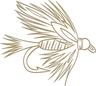

# Walden Hollow

**A private fly-fishing club's logbook, map, and fish record, and an attempt to
make PIT tagging obsolete.**

iOS today, Android next. Built for one club on the Colorado River, now being
made sellable to many. The source is private; this repository is the public
account of what it is, why it is built the way it is, and where the interesting
engineering turned out to be.

---

## The problem it actually solves

A private fishing club knows less about its own water than you would think.

Members catch fish, tell each other about it in the lodge, and the knowledge
dies there. Nobody can answer the questions that decide how a club spends money:

- Is the fishery improving, or does it just feel that way this year?
- Did the fish we stocked in the lower meadow survive? Move? Grow?
- Which holes carry the population, and which are we over-fishing?
- Is this the same brown that broke off at the Chute last September?

The last question is the one that matters most, and it is the one no logbook has
ever been able to answer.

A club can pay for a fisheries survey to find out. Colorado Parks and Wildlife
surveys smaller streams roughly **once every five to ten years**, which is a
snapshot, not a trend, and it is not the club's own water on the club's own
schedule.

## What it does

**Log a catch in under thirty seconds, one-handed, standing in a river.**
Species, length, hole, fly, water conditions. The gauge and weather readings
attach themselves from public USGS and NWS feeds, so the record carries the
conditions that produced the fish rather than the conditions when somebody
remembered to write it down.

**Every hole on a map**, with the club's own names and its own numbering, not a
public trail app's idea of where the river is.

**A named fish's whole history.** When a fish is identifiable, the app shows
every time it has been caught, by whom, where, and how much it has grown. This
is the feature that turns a logbook into a fishery record.

**A record the club owns.** Not a spreadsheet on one member's laptop.

## Who it was built for, and why that shaped everything

The first club is my father's. That is worth stating plainly, because it is both
the origin and the single most useful constraint on the project.

The members skew older and non-technical. The primary tester is a retired man in
his seventies wearing waders, in bright sun, with cold wet hands, holding a live
fish he wants back in the water. **He cannot work around a bug.** He will not
force-quit and retry. He will not read an error message and infer what went
wrong. A stuck "Loading…" screen is, to him, a broken app, and he will put the
phone away and go back to the lodge.

Every engineering rule in the project traces back to that person:

- Loading and error state is cleared in a `finally`, never after the `await`,
  because the failure mode of getting that wrong is an infinite spinner, and an
  infinite spinner is indistinguishable from a broken app.
- Every list query carries a `limit()`, and the caps **warn when hit rather than
  truncating silently**. A member quietly not seeing some of their holes is
  worse than the unbounded read it replaced.
- Confirmations happen where the thumb already is. Making him scroll to continue
  is a design bug, not a nitpick.

That constraint turned out to be the most valuable thing about building for a
real, specific, non-technical user rather than an imagined one.

## How it was sold

It was not a cold sale, and pretending otherwise would be silly. It started as
software for my father's club, which is the ideal first customer: a real
fishery, real members, real money already being spent on stocking, and a board
that would tell me the truth.

What made it a *product* rather than a favour was the second conversation: what
a club that is not my father's would need before it would pay. That produced a
concrete list:

- **Per-club configuration.** Club name, map centre, gauge station, and fly list
  were hardcoded constants. They are becoming a per-club config document.
- **Tenant isolation that is proven, not assumed.** There is no server:
  Firestore and Storage security rules are the *entire* authorization system.
  Before a second club's data goes anywhere near production, a cross-tenant
  denial test has to be green.
- **Onboarding a club has to be a documented, repeatable procedure**, not a
  founder with a terminal.

The commercial model is per-club billing, where the club pays rather than the
individual member, with a tapered setup fee covering the hardware and the
initial survey. Individual subscriptions were considered and rejected: a fishery
record that only some members contribute to is not a fishery record.

---

## The interesting part: making the tag obsolete

> "Individual fish identification and recognition is an important step in the
> conservation and management of fisheries."
>
> Source: [Applied Sciences 11(19):9039, 2021](https://doi.org/10.3390/app11199039)

That is the premise. Knowing *which* fish, not just how many, is what turns
angling records into fisheries science: growth rates, movement between reaches,
and survival after stocking are all questions about individuals. The obstacle has
never been the willingness of anglers to record what they catch. It has been that
identifying an individual fish required catching it and putting a foreign object
inside it.

Today the club tracks individual fish by **PIT tag**. An administrator implants
a chip at stocking, and a member links a catch to a named fish by hand.

That works, and it has three hard limits:

1. It is **invasive**. The fish is handled and a foreign object is implanted.
2. It only covers fish **the club has physically handled**, which is a dozen or
   so.
3. The population that can be studied is capped by how much time the club has
   for tagging.

**Brown and rainbow trout already carry a unique identifier.** The spot pattern
on their flank is individual, like a fingerprint, and it is stable over years.
If that pattern can be matched from a photograph, the fish is already wearing
its own tag. No handling, and *every fish caught becomes a tracked individual*
rather than only the dozen that were chipped.

### The hardware, and why it is temporary

Version 1 ships with physical equipment, and the equipment is deliberately
scaffolding:

| Hardware | Job in v1 | Why it goes away |
|---|---|---|
| **Measuring mat** | A consistent, in-frame length reference so growth is comparable between members and across seasons | A rectified photo with known landmarks gives length without a mat |
| **PIT chips + reader** | **Ground truth.** A chipped fish photographed twice is one labelled pair, the only way to prove a photo matcher works | Once the matcher clears its accuracy bar, the chip is validating something already known |

This is the actual thesis: **the chips exist to make themselves unnecessary.**

Every chipped fish is a labelled training and validation example. As
photographic coverage of a reach grows (more fish, more recaptures, more
seasons), the matcher's gallery approaches full coverage of the population, and
the marginal value of implanting another chip goes to zero. The hardware tapers
out of the product on its own schedule, per river, as the photographic record of
that ecosystem fills in.

Nothing about that is guaranteed to work, which is why it is being run as
research with explicit kill gates rather than as a feature with a ship date.

### How the matching works

Six stages. Only the last two are what people mean when they say "AI".

```
 1. Capture      guided overlay, quality-gated, burst of ~10 frames
 2. Segment      isolate the flank from net, hands, water, gravel
 3. Rectify      warp to a canonical frame using landmarks
                 (snout tip, eye, adipose fin, tail fork)
 4. Extract      blob detection over the rectified flank
                 → a list of spot centroids and sizes: a constellation
 5. Match        point-set matching against every known fish,
                 scored by residual after best-fit correspondence
 6. Confirm      ranked candidates, side by side; a human decides
```

**Stage 3 is the one that decides whether any of it works.** Two photographs of
the same fish at different angles produce different spot geometry. Rectification
is what makes them comparable, and without it stages 4 and 5 are matching noise.

**Stage 5 needs no training data at all.** Point-set matching is the approach
behind [I3S](https://reijns.com/i3s/), used for decades on whale sharks and sea
turtles. It comes before any neural network specifically because it can be
evaluated on a few dozen fish, which is the dataset that actually exists.

**Stage 6 never auto-assigns.** The matcher proposes; a person disposes. A false
match silently corrupts that fish's growth curve and recapture history, which
*is* the science the whole pivot rests on. A missed match costs one manual link.
The two errors are not symmetric, and the interface reflects that.

### What the evidence says, including against

Honest summary, because a portfolio that only cites the encouraging papers is
not evidence of judgment.

**In favour, quoted rather than summarised:**

> "One of most frequently used methods involves capturing and tagging fish.
> However, these processes have been reported to cause tissue damage, premature
> tag loss, and decreased swimming capacity."
>
> Source: *Photo Identification of Individual Salmo trutta Based on Deep Learning*,
> [Applied Sciences 11(19):9039, 2021](https://doi.org/10.3390/app11199039)

That is the case for the whole project in two sentences: the tag is not merely
expensive, it harms the animal. The same study identified individual brown trout
from video at **94.6% precision and 74.3% recall**, on TROUT39 (39 brown trout
across 288 frames) and NINA204. The gap between those two numbers is why the
product surfaces a ranked shortlist for a human rather than an automatic answer:
high precision with mediocre recall means "when it speaks it is usually right,
but it often declines to speak," which is a usable product only if a person is
in the loop.

> "In both populations, all annotated images ranked the first ranking score,
> indicating perfect recognition. The long-term analysis revealed a high
> performance in recognition of individuals because 75% of the images of fish at
> the age of 2 years were successfully matched with images of the same fish at
> the age of 3 years."
>
> Source: Colihueque N, Estay F (2025), *Photo-identification of individual rainbow
> trout, Oncorhynchus mykiss, using the flank spot pattern*,
> [Acta Ichthyologica et Piscatoria 55: 181-190](https://doi.org/10.3897/aiep.55.151044)

Two populations, one wild (n=56, Calafquén Lake) and one farmed (n=45). The
pattern survives a year of growth, which is the property the entire idea depends
on. Note the method: they scored spot patterns with **I3S**, an interactive
identification system used on whale sharks and sea turtles for two decades, with
no training data at all. That is why Stage 5 of the pipeline is point-set
matching before it is anything neural: it can be evaluated on the few dozen fish
a single club actually has.

> "We proved that the methodology can be used as a non-invasive substitute for
> invasive fish tagging. The methodology can be adapted to any fish species with
> dot skin patterns."
>
> Source: Automatic identification of individual Atlantic salmon (*Salmo salar*) by dot
> skin patterns, tested on **328 individuals at 100% accuracy**,
> [Scientific Reports 11, 2021](https://www.nature.com/articles/s41598-021-96476-4)

The strongest result of the three, and the one that makes "substitute for
tagging" a quotable claim rather than a hope. It also names the condition:
controlled photography. Their fish were photographed in a rig. Ours are held by
an angler in a river, which is the entire reason the app draws a trout outline on
the camera and refuses a frame that is too small, too angled or out of focus.
**The guide is not a nicety. It is the experimental control, moved onto a
phone.**

**Against:**

- Published results use **small populations** (TROUT39 is 39 fish), under
  **controlled photography**, mostly **short-term**.
- A [2025 review in *Reviews in Aquaculture*](https://onlinelibrary.wiley.com/doi/10.1111/raq.70078) still lists long-term and large-population performance as **open research gaps**.
- Rainbow spots are finer and denser than brown. Expect worse performance.
- **Nothing in the literature was validated on photographs taken one-handed by
  an angler standing in a river.** That is the actual operating condition, and
  it is the gap this project sits in.

**Realistic outcome: this works well for brown trout with disciplined capture,
and marginally for rainbows.** That would still be worth shipping, scoped
honestly.

### The trap in a 15-fish gallery

This is the part I most want to be judged on.

A club has ten to fifteen chipped fish. Rank-1 accuracy against fifteen
candidates will look *excellent* and mean **almost nothing**. Random chance
alone is 1-in-15, about 6.7%, and real galleries will hold hundreds. Accuracy
degrades as the gallery grows.

So the evaluation is designed to be able to fail:

| Metric | Question it answers |
|---|---|
| **Rank-1 accuracy** | Is the correct fish the top candidate? |
| **CMC top-5** | Is it anywhere in a shortlist a human would scan? |
| **False accept rate** at the match threshold | How often does an *unknown* fish get confidently matched to the wrong known fish? |

The third matters most. This is an **open-set** problem, since a caught fish may
or may not already be in the database, and a confident wrong answer is the error
that corrupts the science. Results are reported against the chance baseline for
that gallery size, and the gallery is padded with published trout imagery to
simulate larger populations.

**The bar to proceed:** rank-1 must clear the chance baseline by a wide margin
at every simulated gallery size, **and** false accepts must be pushable to near
zero by raising the threshold without collapsing rank-1. A conservative "no
match" is a usable product. A confident wrong answer is not.

If it does not clear that bar, it gets abandoned, and the club keeps a very good
logbook.

---

## Citizen science, and where this goes beyond one club

A club running this produces something Colorado Parks and Wildlife does not
have: **continuous, photo-verified, individually-tracked recapture data on a
single reach, season after season.** Against a survey cadence of five to ten
years, that is a different kind of dataset.

The honest position on funding, having actually researched it:

- **CPW's grant programs do not fund this.** All seventeen of them are habitat,
  access, and education. *Fishing is Fun*, the closest fit at $650k/yr,
  explicitly excludes "equipment, research, data collection, or software," and
  private clubs are not on its eligible list. Most programs require a government
  or non-profit applicant, which a for-profit software business is not.
- **Partnership is the higher-value play, and it costs nothing.** A club
  producing this data is genuinely useful to CPW's Aquatic Research Section. No
  application, no reporting obligation, and a state-agency relationship is what
  makes any later federal application credible.
- **The federal [CitSci Fund](https://www.fs.usda.gov/working-with-us/citizen-science) is the real thematic fit** at $20–30k, and it requires a partnership agreement with a Forest Service unit, which is the same relationship, arrived at from the other side.

There are strings worth reading before signing anything: open-data obligations
can conflict with selling the software, and members joined a *private* club.
Their catch locations becoming public is a trust question before it is a
licensing one.

---

## Engineering notes

The parts worth a reader's time.

### There is no server, so the security rules *are* the authorization system

Firestore and Storage rules are the entire authorization surface. If they are
wrong, the app is wrong, and no client code can save it. They are treated as
production code: versioned, reviewed, and unit-tested against the Firebase
emulator.

**The emulator cannot prove the rules will run in production, and that cost a
whole beta.**

`storage.rules` calls `firestore.exists()` to check club membership. That is a
*cross-service* rule, and the Storage rules engine needs an IAM grant to read
Firestore, which the Firebase Console offers when you edit such a rule there,
and which a CLI deploy never prompts for. Without it, `firestore.exists()`
evaluates false for everyone and **every upload is denied.**

Catch photos were silently discarded for the entire first beta while **sixteen
green emulator tests** said the logic was correct.

The lesson is not "write more tests." The tests were right. The lesson is that a
test double can be faithful to the logic and unfaithful to the boundary, and the
fix is a post-deploy check against the real backend: sign in as a real member,
read a path that does not exist. `object-not-found` means the rule passed.
`unauthorized` means it did not.

### A bug class that keeps recurring: create/update never implies delete

`match /outings/{outingId}` had `read`, `create` and `update` rules and **no
`delete` rule**, so deleting an outing was silently denied. The same class had
already been fixed for `holes` and `catch_flies`.

It is worth naming because the failure is always silent. The delete simply does
not happen, and the UI has no way to tell that apart from a slow network.

```
// Every collection with create/update rules gets an explicit delete rule,
// and a test for who may NOT use it.
//   ✓ owner can delete            ✓ admin can delete
//   ✗ another member cannot       ✗ a guest cannot
//   ✗ ownership cannot be transferred
```

### Guided capture: the geometry is the feature

The overlay that tells an angler how to hold a fish is not decoration. Stage 0
found two photographs of the same fish, six weeks apart, sharing almost no
comparable flank: one side-on, one angled. No matcher can align those.

Two decisions worth writing down:

**The guide is drawn as vector paths, not a PNG silhouette.** The first version
was described by the tester as "a circle, a triangle and a dot for the eye".
Fair, and it mattered, because a shape nobody reads as a trout cannot tell them
which way round to hold one. A raster asset would have fixed the likeness and
lost three things: the outline could not be recoloured per state, it would
soften on a tall screen, and the landmarks a rectification step needs would have
been baked into pixels instead of being addressable geometry.

**Enforcing one flank was wrong, and the fix was to stop enforcing.** The app
originally demanded the right flank, reasoning that the two flanks are
independent patterns, and mirroring does not convert one into the other, so a
mixed gallery means no fish can match itself. That reasoning is correct and the
enforcement was still wrong: on the water, members photograph whichever side the
fish presents. Enforcement did not change their behaviour, it just made the
recorded side **false for about half the captures**, and a wrong label is worse
than a missing one, because it files a left flank into the right gallery where
it can never match *and* corrupts the side it landed in.

The gallery is split in two instead, and the angler tells the app which side
they are shooting.

### Landscape capture: the obvious metric was the wrong metric

A trout is a long thin subject and on the bank it is usually lying down. Adding
landscape support meant the guide is sized inside what the controls leave, so
the fish spans a **smaller** fraction of the frame than in portrait, about 63%
against 75%.

That reads as a regression and is the opposite. The fill fraction is a fraction
of frame *width*, and in landscape the frame's width is the sensor's *long*
axis. Measured on the same phone, the fish lands on about **2,555 sensor pixels
in landscape against 2,268 in portrait**, 13% more detail, at a lower
percentage.

Lower number on screen, better photograph. The comment in the source says so,
because the next person to read that constant will otherwise "fix" it.

### Everything runs from fixtures, and the fixtures are fictional on purpose

The app runs entirely from local fixture data with no Firebase connection at
all. That is a development convenience and it is also what App Store screenshots
and any public demo are captured from.

The fixtures used to carry the club's **real coordinates and all 27 real hole
names**, copied off the board in the lodge. Which meant anyone with the App
Store listing could have put the private water on a map. A bad first impression
for a product whose whole pitch is "private club," and a real exposure for the
members.

They now describe a fictional reach on public water, with coordinates
interpolated off the OpenStreetMap river centreline so the holes sit *in* the
river rather than beside it. There is **one** dataset and it is fictional. A
separate "safe" dataset only stays safe while everyone remembers which is which,
and that failure is silent and permanent once published.

The guard is a test, not a comment asking the next person to be careful:

```
✓ puts no hole anywhere near the club water        (>50 km from the real reach)
✓ reuses none of the club hole names               (checked against live seed data)
✓ keeps every hole on the demo reach               (or the map opens on empty water)
✓ names the same holes in the catches as the list  (catches embed {id, name})
```

That last one exists because catches embed the hole's name rather than
referencing it, so a rename can leave a real name behind in the history view
while the map looks perfectly clean.

### Stack

React Native / Expo · TypeScript (strict) · Firebase (Firestore, Auth, Storage)
· Mapbox · USGS and NWS public feeds · Jest · GitHub Actions · EAS Build

One codebase, both platforms. Android is a build target, not a fork.

---

## Status

| | |
|---|---|
| **iOS** | In TestFlight with a real club |
| **Android** | Buildable; not yet shipped |
| **Multi-tenancy** | In progress. Cross-tenant isolation must be proven before a second club's data exists |
| **Photo identification** | **Research, not a feature.** Guided capture ships; the matcher is being validated offline against chipped-fish ground truth |

Saying that last row plainly is deliberate. The interesting claim here is not
that spot matching works. It is that the project knows what would prove it
doesn't.

---

<sub>The application source is private. Questions welcome.</sub>
